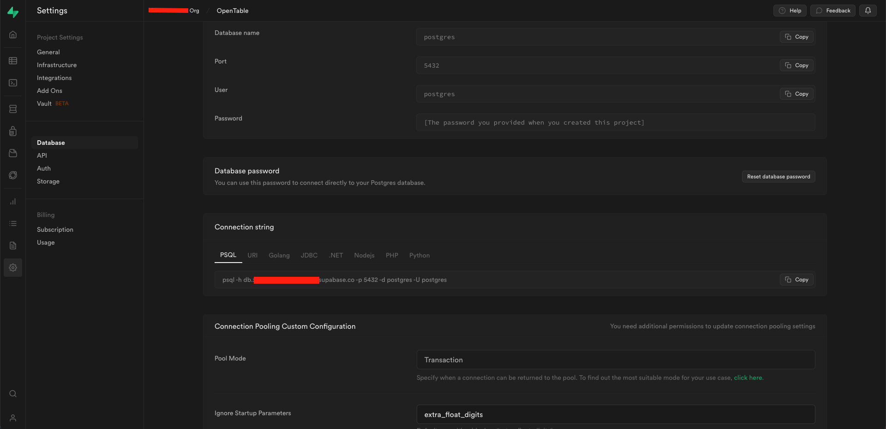

# openTable
## Setup and connect a PostgreSQL Database
**Step 1:** Create a [https://supabase.com/](supabase) account

**Step 2:** Create a project within supabase.
> This will create PostgreSQL Database

**Step 3:** Copy the `Database Password` and temporarily paste it somewhere

**Step 4:** Navigate to the `Dashboard / Settings / Database`

**Step 5:** Copy the `Connection string`


**Step 6:** Copy the `Connection string` into the `DATABASE_URL` and paste this into in the `.env` file

**Step 7:** Replace the `randompassword` with the `Database Password`

## Seed the Database
**Step 1:** Open the terminal and navigate to the root of the project and run this command to create the tables defined in the `schema.prisma` file
```bash
npx prisma db push
```

**Step 2:** Run the development server
```bash
npm run dev
```
**Step 3:** Seed the Database by navigating to [http://localhost:3000/api/seed](http://localhost:3000/api/seed) in the browser
> if you navigate back supabase within your browser, you'll notice that you have created tables within your database.

## You're all set, the frontend is connected to the Database:
Open [http://localhost:3000](http://localhost:3000) with your browser to see the result. 🤞
